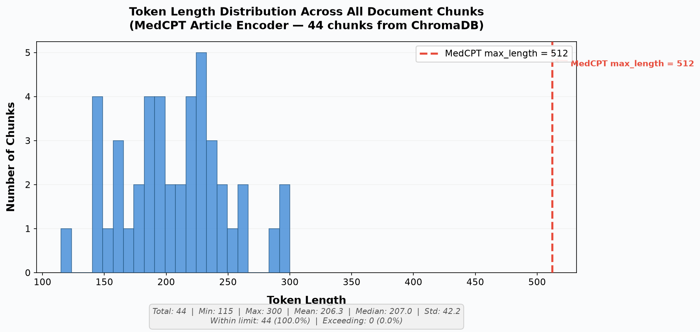

# Chunk Token-Length Validation Report

**Generated:** 2026-09-02 20:43:50
**Project:** Diabetes-in-Adolescents RAG System

---

## Methodology

This validation tests whether the adaptive chunking strategy (implemented in `ingest.py`)
produces chunks that fit within MedCPT Article Encoder's **512-token** input limit.

### What was tested
- **44 chunks** retrieved from the `research_abstracts` collection in ChromaDB (`./vector_db`)
- Each chunk was tokenized using the **MedCPT Article Encoder tokenizer** (`ncbi/MedCPT-Article-Encoder`)
- Tokenization used `truncation=False` to capture **true** token counts (not clipped values)
- The tokenizer was called with `[["", chunk_text]]` pairs (empty title + abstract) to match the encoding used during ingestion

### Chunking configuration
- `MAX_CHUNK_SIZE = 2000` characters (set in `ingest.py`)
- Adaptive sentence-boundary splitting for texts exceeding this limit
- Rationale: biomedical text averages ~4–5 characters per token, so 2000 chars ≈ 400–500 tokens

---

## Summary Statistics

| Metric | Value |
|--------|-------|
| Total chunks | 44 |
| Min token length | 115 |
| Max token length | 300 |
| Mean token length | 206.3 |
| Median token length | 207.0 |
| Standard deviation | 42.2 |
| Within 512-token limit | 44 (100.0%) |
| Exceeding 512-token limit | 0 (0.0%) |

---

## Edge Cases

No chunks exceed 512 tokens. All chunk content was fully encoded into the embedding vectors without truncation.

---

## Token Length Distribution

---

## Verdict

✅ **PASS** — Adaptive chunking successfully kept 100% of chunks within MedCPT's 512-token limit. No adjustments needed.
